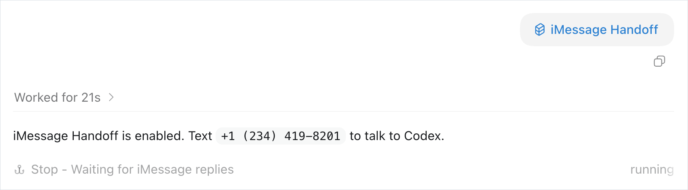
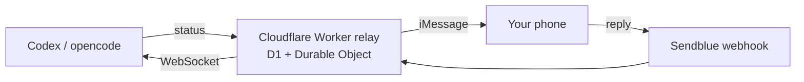

# Agent iMessage Handoff — text your coding agent

Walk away from your desk. Your agent keeps working and texts you when it needs you. Reply from your phone and it carries on.



One self-hosted relay on Cloudflare's free tier, with bridges for Codex, Codex-plus and opencode. Message content is never persisted.



TypeScript · Cloudflare Workers · D1 · Durable Objects · Sendblue

---

## Layout

- `relay/` - the shared Cloudflare Worker relay (D1 + Durable Object + Sendblue). One relay serves every harness.
- `codex/` - Codex CLI harness: the original skill (Stop hook based).
- `codex-plus/` - Codex variant with the local reliability layer (doctor, repair, recovery, simulator, dashboard, redaction).
- `opencode/` - opencode harness: skill + plugin (the Stop hook is replaced by a plugin that reacts to `session.idle` and injects replies via the SDK).

## Which One Do I Use?

- Working in Codex CLI: use `codex/` (or `codex-plus/` if you want the reliability tooling).
- Working in opencode: use `opencode/`.
- Either way you need the `relay/` deployed once.

## Adding a New Harness

1. Fork this repo.
2. Read how the existing harnesses bridge the relay: register the thread (`POST /threads/:id`), publish output (`POST /threads/:id/status`), wait for replies (`GET /threads/:id/events` WebSocket), claim (`POST /threads/:id/replies/:replyId/claim`), stop (`POST /threads/:id/stop`).
3. Add a folder named after your harness with the smallest bridge that can do those five things.
4. Open a PR back if it is useful to others.

## Relay Setup (once)

Self-host on Cloudflare free tier:

1. `cd relay && npm install`
2. `npx wrangler login`
3. `npx wrangler d1 create imessage-handoff` and put the returned `database_id` in `relay/wrangler.jsonc`
4. Set `SENDBLUE_FROM_NUMBER` in `relay/wrangler.jsonc` to your Sendblue number
5. Apply migrations BEFORE deploying (the original hosted relay is broken because it skipped this):
   - `npx wrangler d1 migrations apply imessage-handoff --remote`
6. `npx wrangler secret put SENDBLUE_API_KEY` / `SENDBLUE_SECRET_KEY` / `SENDBLUE_WEBHOOK_SECRET`
7. `npx wrangler deploy`
8. In the Sendblue dashboard: inbound webhook = `https://<your-worker>/webhooks/sendblue`, signing secret = the value you stored in `SENDBLUE_WEBHOOK_SECRET`

Sendblue free tier works: the pairing flow has the user text the relay number first, which verifies the contact.

## Harness Setup

### opencode

- Copy `opencode/imessage-handoff/` to `~/.config/opencode/skill/imessage-handoff/`
- Copy `opencode/plugin/imessage-handoff.js` to `~/.config/opencode/plugins/`
- Restart opencode, then say `start handoff`

### Codex

- Install the skill folder (`codex/imessage-handoff/`) as a Codex skill, or use `$skill-installer` with the original repo
- Say `$imessage-handoff` in a thread

### Point a harness at your relay

```
node <skill>/scripts/handoff-cli.js config set apiBaseUrl https://<your-worker>.workers.dev
```

## Security Model

The relay stores routing metadata only (thread state, pairing, phone bindings) and never persists message content. Inbound messages live briefly in the Durable Object memory until claimed, then are scrubbed. Cloudflare log persistence is disabled in `wrangler.jsonc`. Keep each harness's `.state/config.json` private - it holds the token linked to your phone. Reset with `handoff-cli.js config reset-token`.

## iMessage Formatting

Handoff answers are delivered as plain text. All harness bridges instruct the model to avoid markdown tables, headers, and code fences in replies, and to structure with short lines, dashes, and blank lines.

## Credits

- Original Codex skill and relay: gragland/codex-imessage-handoff
- Reliability layer and relay migration fixes: iice257
- opencode port: iice257
